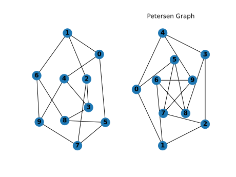

# Python_Networkx

My programs showing Networkx samples Network analysis/graph theory 

[Hello world networkx](https://github.com/kephalian/Python_Networkx/blob/main/networks_hello_world.py)

[PyVIZ demo notebook](https://github.com/kephalian/Python_Networkx/blob/main/PyVIZ_demo.ipynb)
